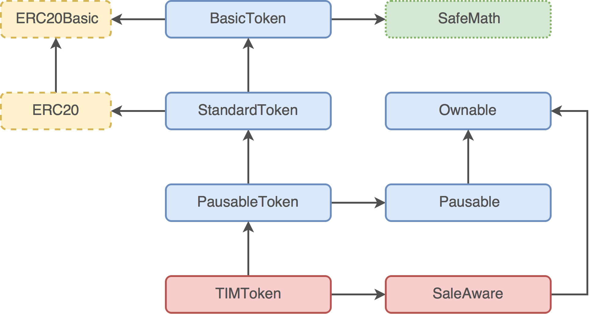

# Chainium Smart Contracts



## Setup

Global prerequisites:

```
$ sudo npm install -g truffle
$ sudo npm install -g ethereumjs-testrpc
```

Repository:

```
$ git clone https://github.com/Chainium/SmartContracts.git SmartContracts
$ cd ./SmartContracts/src
$ npm install
```

## Running Tests

Make sure to start fresh instance of TestRPC before running each test suite:

```
$ truffle test ./test/CHXToken.js
$ truffle test ./test/CHXTokenSale.js
$ truffle test ./test/CHXTokenSaleRefund.js
```

### TestRPC

Command for starting TestRPC instance:

```
testrpc -l 6700000 \
    --account="0x8ba39fadc4133519aec601bab4165a638aaf2a24f394c29455f98faf3d9e2d8f,1000000000000000000000000" \
    --account="0xed06aef8a4f1dbf067c5984c1487ddb4a21518f328212eef0e1af1a639b72283,1000000000000000000000000" \
    --account="0xfd1ffedb4200886b066622733f72fdf52f18a3ef75849c234133d4a610fa3128,1000000000000000000000000" \
    --account="0x8d5ecea78c3d34110b58d8ae697aa09d73e977cf9ea028124294aa70c231d889,1000000000000000000000000" \
    --account="0x043ac750643508bacc80746681dc531cbdf348985d20128b62f512f760e8f0e1,1000000000000000000000000" \
    --account="0xcafeaa8acbf71a94f7f060cc1bf878ba173c7291b39e209e54ca2a110c84ddfa,1000000000000000000000000" \
    --account="0x0db175ce745cec4f747839f0ae002c2aa899708e89a51d8737cc486060d62841,0" \
    --account="0xd633285956dcd0e34864fb7d2edfd407229b321d59cb7d9bc2caa10754b2c52a,0" \
    --account="0x245a3d9db6ddc5e029c929d145001fac578f89b780881094c4228f406dbbb10d,0" \
    --account="0x54955438aff7bebaa3357a58a8bc3b934517b0befbc31527d6b156362721ff41,0" \
    --account="0x8a82761a4ee472dd07b0c300a1d67f18363240f7e2b1dea8fc7fd74f717bf3f9,0" \
    -u 0 -u 1 -u 2 -u 3 -u 4
```

Mnemonic: `oil tonight cat soldier acquire friend ladder reward skirt sand toast grab`

Address | Role
---|---
0xA9490D512812b2ea0dC2063bF496c7129319A6eE | Admin
0x26c9DfF207ED3E98aDb961906F94A3e938DFc11d | Investor 1
0x2fAe4b8aEFab308038ab5f04f447F27EE30f5506 | Investor 2
0x0CAaAf9B56d99839bede55D831Ad8028b1373D9a | Investor 3
0xEe71722eA189E8E578534424126c0157a644c090 | Investor 4
0x226E6426eAc1163a7c57C63c98Aa54AF7FABcd3F | Sale Operator
0xC3133130Ef27Fc9AE86F9B79f99456B4C2566d74 | Founders
0x3441A4154c43fF1ADDaffEde60BBD1f6ef20a1C9 | ICO Costs
0x548615698D8d12e13c402a6D19C1d4F9a3171372 | Reserve Fund
0xaDDb2268d5Ba05a1165FD7dD0F01C3823a9bb935 | Token Refund
0x67A2aa7E9a8C8AAb54d4e30a1471Aa2940D5d259 | Raised Ether
