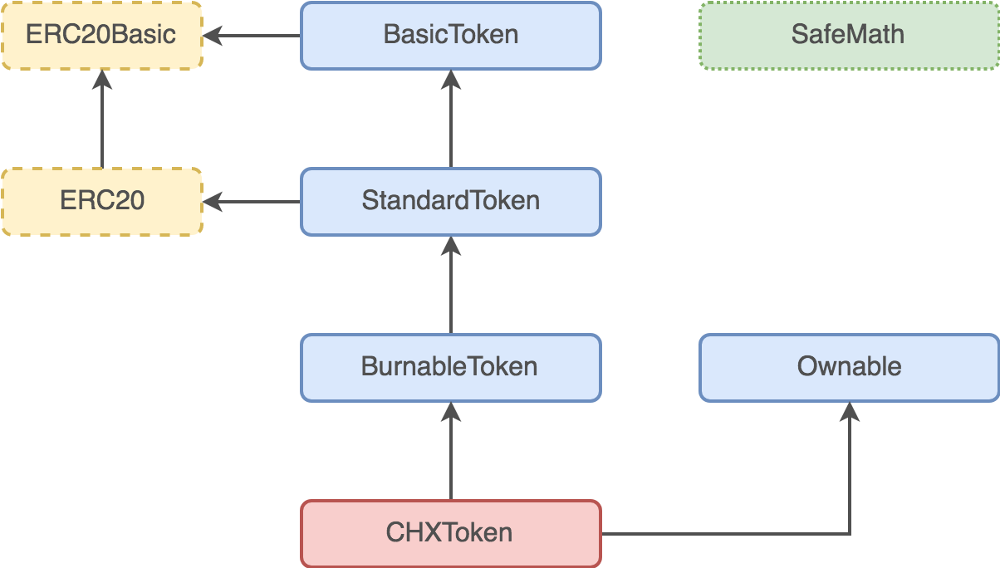

Functional Specification of CHX Contracts
=========================================

There are two contracts taking part in CHX token distribution and usage:

- CHXToken
- CHXTokenSale

## CHXToken Contract

`CHXToken` is an [ERC20](https://theethereum.wiki/w/index.php/ERC20_Token_Standard) token contract, with the main purpose of keeping the records of CHX token holders' balances, and enabling transfers of tokens.

`CHXToken` contract is implemented by inheriting from base contracts available in [OpenZeppelin](https://github.com/OpenZeppelin/zeppelin-solidity) library, as well as extending them by adding new functionality:

- Batch transfers
- Restricted transfers during token sale
- Draining stray Ether and other ERC20 tokens

### Batch transfers

To enable cost-effective transfers of tokens from/to multiple addresses, without having to process multiple transactions, this contract implements following batch transfer functions:

- `batchTransfer`
- `batchTransferFrom`
- `batchTransferFromMany`
- `batchTransferFromManyToMany`
- `batchApprove`
- `batchIncreaseApproval`
- `batchDecreaseApproval`

These functions are iterating over passed arrays of addresses/values and invoking equivalent standard ERC20 non-batch function in each iteration.

### Restricted transfers during token sale

Initial CHX token distribution will be done trough token sale process, which requires transfers to be disabled for general public until the tokens sale is complete. To achieve this, `CHXToken` inherits from `SaleAware` contract.

The purpose of `SaleAware` contract is to provide token sale related information/rules in an isolated way, which prevents pollution of the `CHXToken` code.

`SaleAware` contract provides following functionality:

- Token sale state (`tokenSaleClosed` state variable) and a way for token sale contract (`tokenSaleContract` state variable) to inform about token sale being closed (`closeTokenSale` function).
- Function modifiers for restricting or preventing the function invocation depending on the state of the token sale (`onlyTokenSaleContract`, `restrictedDuringTokenSale`, `onlyDuringTokenSale`, `onlyAfterTokenSale`). This is used to enable token sale contract to execute transfers during token sale, which is needed for sending tokens to investors' addresses in exchange for received Ether.
- Returning tokens for Ether refund. (more information will be provided in `CHXTokenSale` part below)

### Draining stray Ether and other ERC20 tokens

During the token sale, investors will send Ether to `CHXTokenSale` contract. However, `CHXToken` contract is not supposed to ever receive any Ether or other tokens. To prevent mistakenly sent Ether or tokens from being locked in `CHXToken` forever, two functions are provided to enable token contract owner to drain Ether or other ERC20 compatible tokens from `CHXToken` address.

## CHXTokenSale Contract

`CHXTokenSale` contract is the contract used for initial CHX token distribution, which will happen during public token sale period.

Tokens will be distributed in *online* and *offline* sale.

Online sale is an automatic process where Ether is sent to the token sale contract's address, and CHX tokens are received immediately after transaction is mined.

Offline sale is the process where investments are collected through other channels (BTC, LTC, Fiat), and CHX token are received after Chainium staff manually invokes token transfer.

Additionally, `CHXTokenSale` contract inherits from `Whitelistable` contract, which implements the whitelist functionality, used to enforce *Know Your Customer* process (KYC).

### CHXTokenSale Contract Life Cycle

`CHXTokenSale` contract will go through following phases:

- Deployment
- Before public sale
- Public sale
- After public sale

### Deployment

Upon deploying `CHXTokenSale` contract, its constructor will execute, resulting in following:

- State variables are set to their initial values.
- `CHXToken` contract instance is created.
- Total token supply is assigned to token sale contract's address.
- Pre-allocated tokens are transferred to:
    - Chainium founders' wallet
    - Reserve Fund wallet
    - ICO Costs wallet

### Before public sale

Functionality available before public sale starts:

- Setting `offlineSaleCap` parameter by executing `setOfflineSaleCap` function. This is used to allocate certain amount of tokens for *offline* sale.
- Invoking `processOfflinePurchase`, to transfer tokens sold in pre-sale process (which is *offline* only) to the corresponding investors.

Functionality related to *offline* sale is available without time restrictions, due to it being manual activity needing more time to complete.

### Public sale

During public sale, Ether is sent to token sale contract's address, which will invoke *fallback function* (`function() {...}`). Fallback function invokes `buyTokens` function which handles the purchase by doing following:

- Enforce minimum investment and KYC whitelist thresholds.
- Ensure sale cap is not exceeded.
- Transfer tokens to investors address.

KYC whitelist can be updated at any time.

### After public sale

After the sale end time is reached, *online* investments are disabled (`buyTokens` function will throw). *Offline* investments can still be processed, due to the manual nature of the process, which might need more time to complete.

Depending on the success of the token sale, Chainium management can decide to enable refunds, which is done by invoking `enableRefunds` function. While refunds are enabled, investors can execute `claimRefund` function to return their tokens and receive invested Ether back.

If the token sale is deemed successful, and decision is made to make tokens publicly available for transfers, `closeTokenSale` function should be executed, resulting in following:

- Unsold tokens will be transferred to Reserve Fund wallet.
- Collected Ether will be transferred to Founders' wallet.
- Transfer restrictions will be lifted from `CHXToken` contract by invoking its `closeTokenSale` function (defined in `SaleAware`).
